<div align="center">

# listening.archive

### *your year in music — without the algorithm writing it.*

**A private, locally-run alternative to Spotify Wrapped with 5 RAG layers, an MCP server, and a UI that refuses to look like every other AI dashboard.**

[](https://www.python.org)
[](https://fastapi.tiangolo.com)
[](https://modelcontextprotocol.io)
[](LICENSE)

[**Demo**](#demo) · [**Quick Start**](#quick-start) · [**Architecture**](#architecture) · [**Why This Exists**](#why-this-exists)

</div>

---

## Demo

### The hero — anti-Wrapped opening
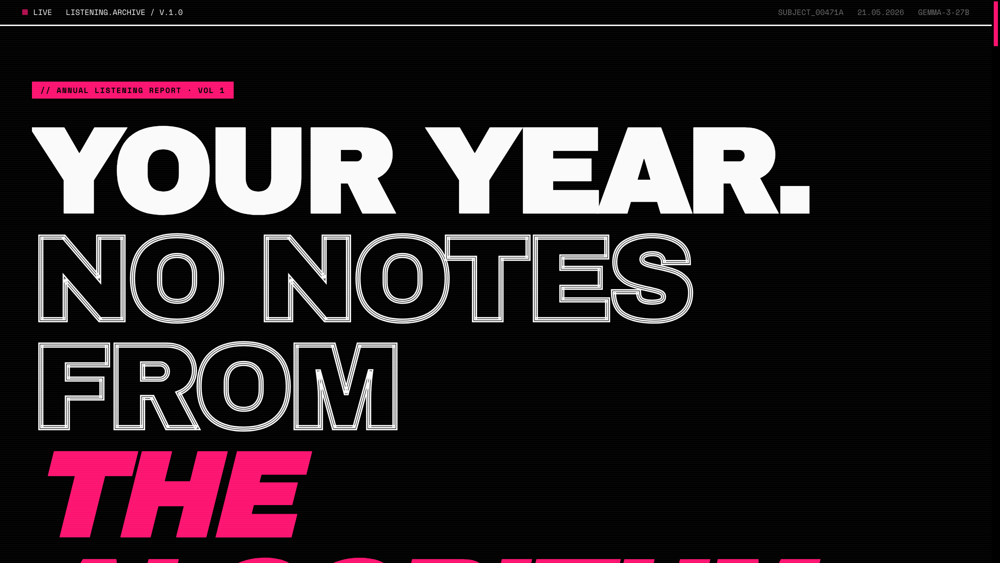
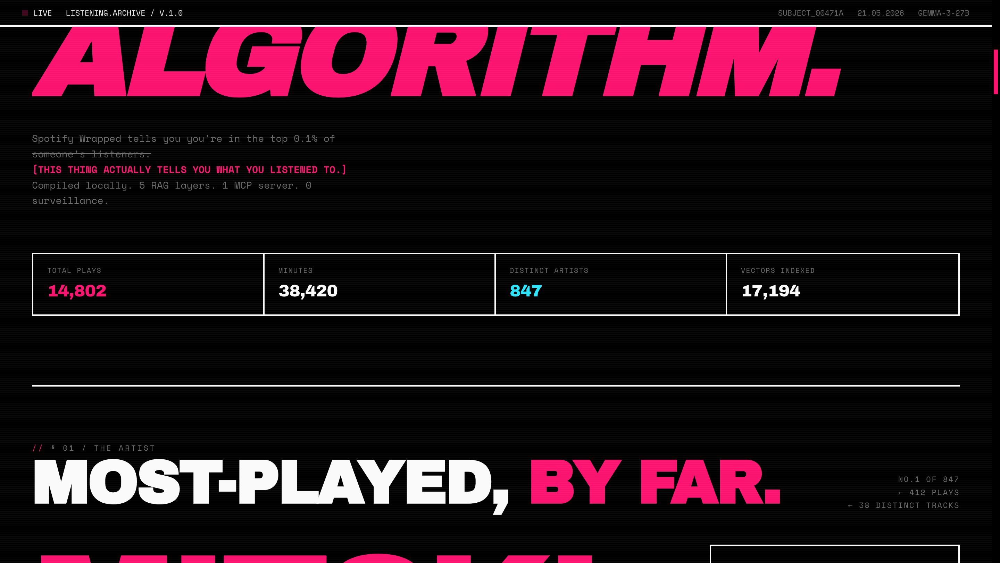

### § 01 — The most-played artist, treated like a feature spread
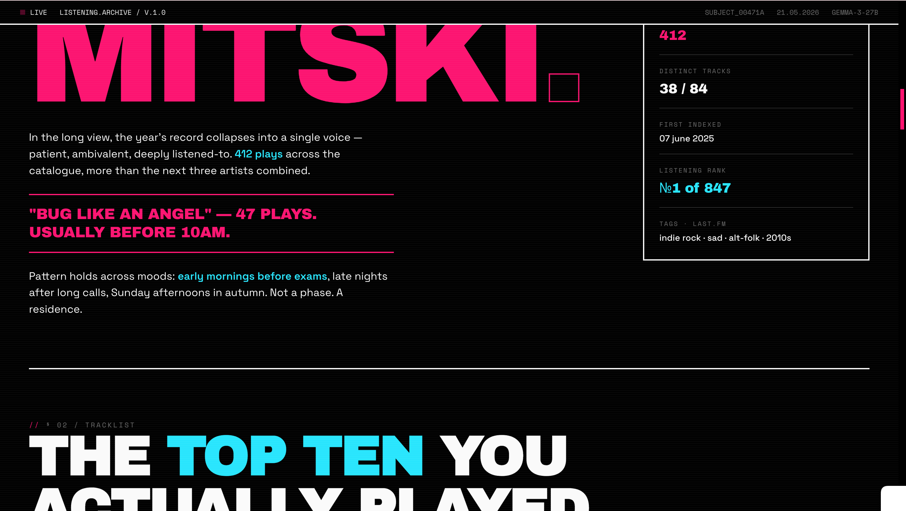

### § 02 — The actual top 10, ranked by play count
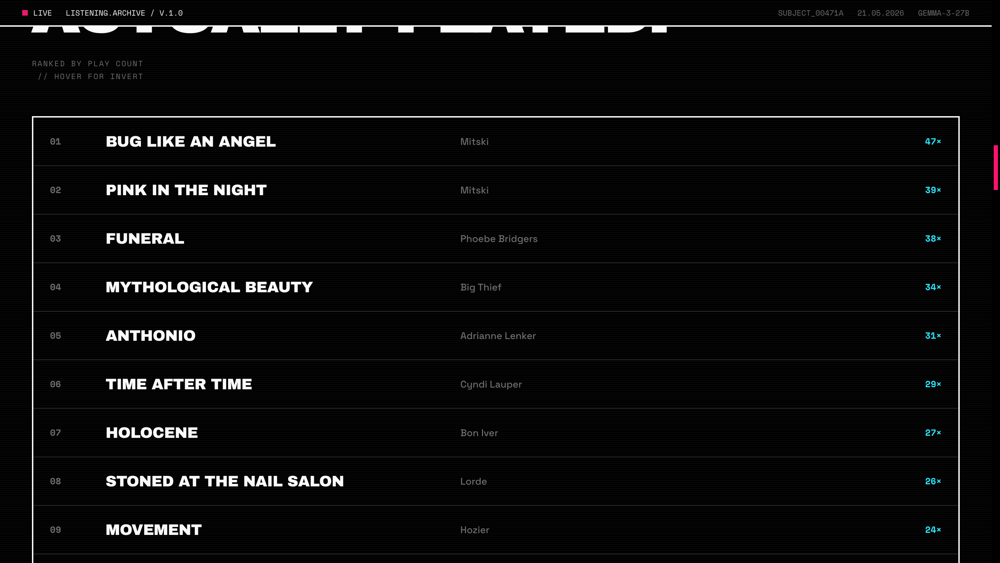

### § 03 — By the numbers
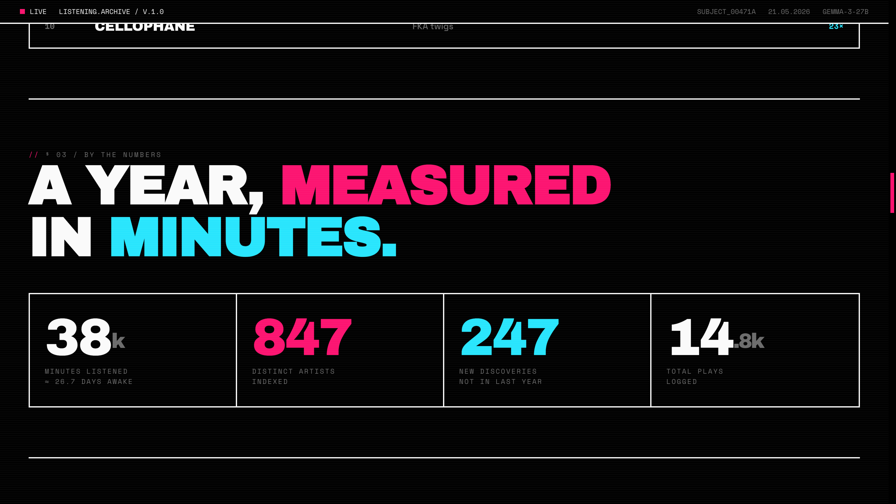

### § 04 — Genre constellation (sized by frequency)
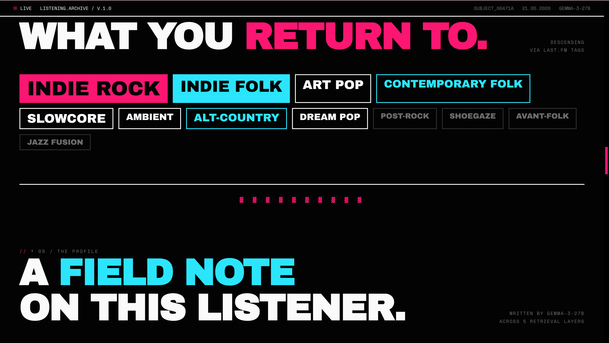

### § 05 — AI-written field note, with retrieval citations
Every claim is grounded in a source retrieved across the 5 RAG layers, cited at the bottom.
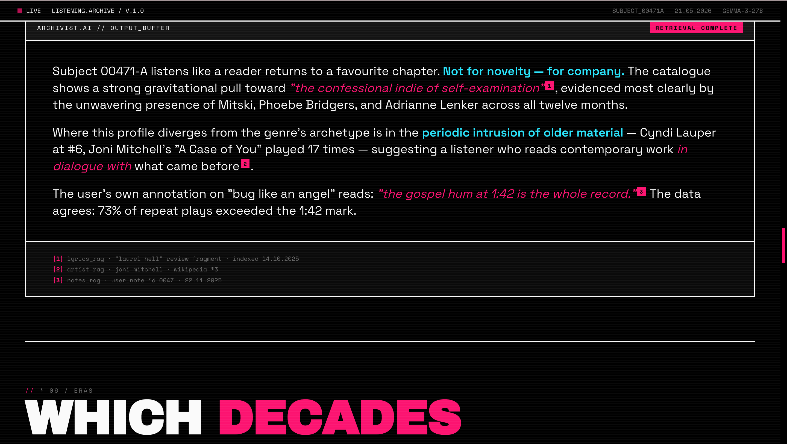

### § 06 — Which decades your catalogue draws from
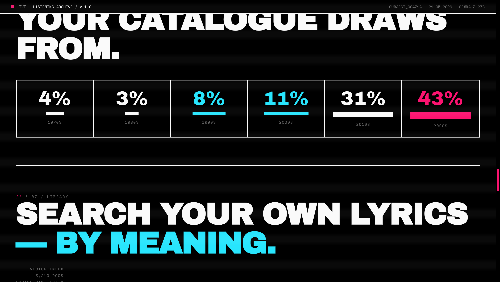

### § 07 — Search your own lyrics, semantically
Plain English; the embedder finds songs whose meaning is closest, not whose words match.
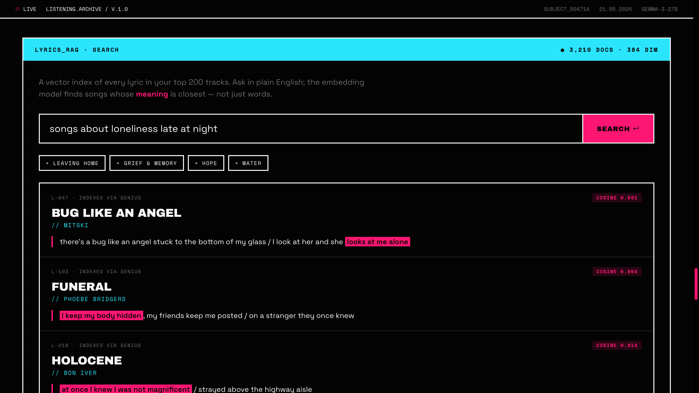

### § 08 — Chat with the archivist (5 RAG layers + 5 MCP tools)
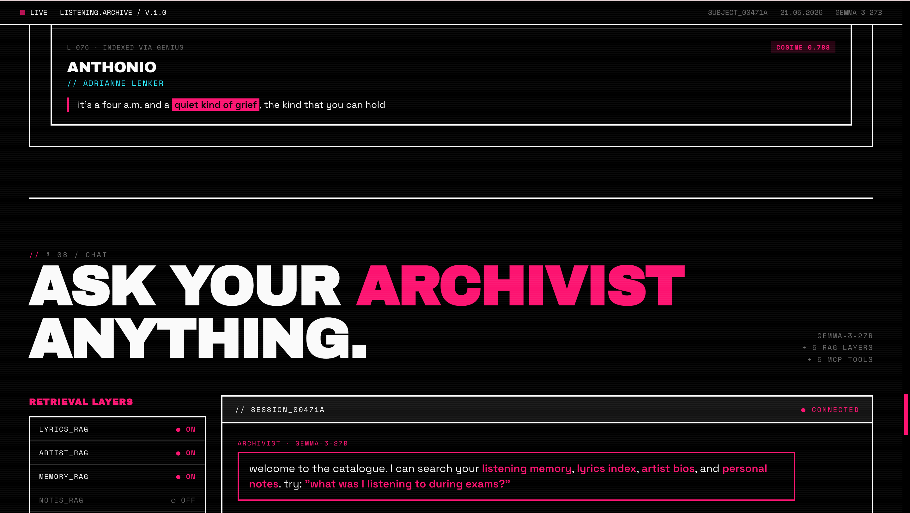

### § 09 — New discoveries this season
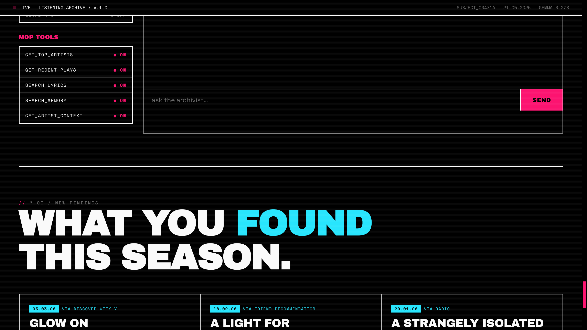

### Footer — the project's actual thesis
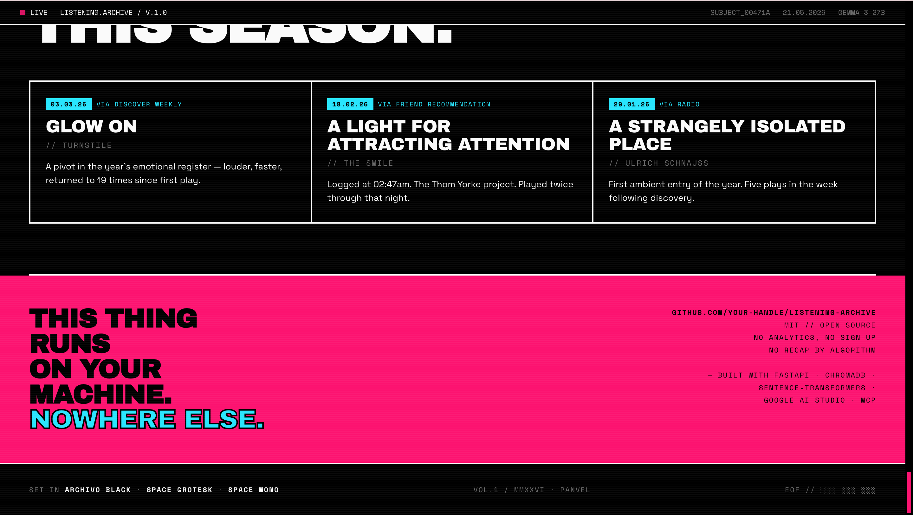

> 💡 **Want to see it move?** Clone and run `make demo` — no Spotify account needed, no API keys required for the visual tour. Demo mode boots in ~30 seconds.

---

## Why this exists

Spotify Wrapped is a **marketing artifact**. It tells you you're in the top 0.1% of someone's listeners, shows you a top-5 of artists you already love, and packages it in colors designed for Instagram stories.

**listening.archive treats your year as a text to be read, searched, and written about** — like a journal you didn't know you were keeping. It uses five separate vector indexes to answer questions Spotify will never ask:

- *"Find songs in my library about loneliness late at night."*
- *"What was I listening to during exam week in March?"*
- *"Tell me about Mitski's lyrical themes — but ground it in actual sources, not vibes."*
- *"How does my taste compare to the indie folk canon as Wikipedia describes it?"*

Data stays on your machine. The LLM runs on Gemini Flash's free tier. The vector DB is local files. The MCP server lets you ask the same questions from Claude Desktop. Cost: **$0**.

---

## How this is different

| | Spotify Wrapped | Stats.fm / receiptify | **listening.archive** |
|---|---|---|---|
| **Released** | once a year | basic stats year-round | continuous, queryable |
| **Privacy** | data on Spotify's servers | third-party servers | **local files only** |
| **Depth** | top 5, top 5, "your aura" | top N lists, basic charts | **5 RAG layers + agentic LLM** |
| **Queryable** | no | filter dropdowns | **natural language, semantic** |
| **Cost** | free (you're the product) | freemium | **$0, you own the data** |
| **MCP integration** | n/a | n/a | **✅ Claude Desktop ready** |
| **Without Spotify Premium** | n/a | requires Spotify auth | **✅ works via GDPR export** |
| **Aesthetic** | Instagram-story bait | dashboard chrome | **anti-dashboard, deliberate** |

---

## The Spotify API restriction story

> In February 2026, Spotify made the Web API **Premium-only** for Developer Mode. This project supports two data paths so it works regardless.

This project was originally built around Spotify's free Web API. Halfway through, Spotify announced that as of March 9, 2026, the Web API would require a Premium subscription, with test users capped at 5 per app. Rather than abandoning the project, I designed the data layer to be **source-agnostic** with two paths:

### Path A — Spotify Web API (requires Premium)
Standard OAuth flow, real-time data, automatic refresh. Set keys in `.env`, click "Connect Spotify" in the app.

### Path B — Spotify GDPR data export (free, no Premium)
Request your full data from spotify.com/account/privacy, unzip the email Spotify sends, run `make ingest path=/path/to/folder`. Gives you years of listening history with one command. Same backend, same UI, same RAG indexes — just a different ingestion source.

Both paths populate the same SQLite + ChromaDB stores. The frontend, MCP server, and 5 RAG layers don't care which path you used.

---

## Architecture

```
┌─────────────────┐    ┌──────────────────┐    ┌─────────────────────┐
│ Spotify Web API │───▶│   FastAPI        │◀───│  Frontend (HTML)    │
│ (Premium req'd) │    │   Backend        │    │  Y2K poster UI      │
└─────────────────┘    │                  │    └─────────────────────┘
        OR             │                  │              
┌─────────────────┐    │                  │    ┌─────────────────────┐
│ Spotify GDPR    │───▶│                  │───▶│  Claude Desktop /   │
│ Data Export     │    │                  │    │  any MCP client     │
│ (free, no Prem) │    │                  │    └─────────────────────┘
└─────────────────┘    │                  │              ▲
                       │                  │              │
┌─────────────────┐    │                  │    ┌─────────┴───────────┐
│  Genius (lyrics)│───▶│                  │    │  MCP Server         │
│  Wikipedia      │───▶│                  │───▶│  (5 tools exposed)  │
└─────────────────┘    │                  │    └─────────────────────┘
                       │   ┌───────────┐  │
                       │   │ 5 RAG     │  │
                       │   │ Layers    │  │
                       │   ├───────────┤  │
                       │   │ lyrics    │  │
                       │   │ memory    │  │
                       │   │ artist    │  │
                       │   │ notes     │  │
                       │   │ genre     │  │
                       │   └─────┬─────┘  │
                       │         ▼        │
                       │   ChromaDB       │   (local persistent files)
                       │   SQLite         │
                       └─────────┬────────┘
                                 │
                         ┌───────▼───────┐
                         │  Gemini 2.5 Flash │  via Google AI Studio
                         │  (free tier)  │  swappable: Gemma 4
                         └───────────────┘
```

**Everything you see runs locally.** The only outbound traffic goes to Spotify (your auth), Google AI Studio (LLM), and Wikipedia/Genius (one-time ingestion).

---

## The five RAG layers

| Layer | What it indexes | Source | Example query |
|---|---|---|---|
| `lyrics_rag` | Song lyrics from your top tracks | Genius API | "Find songs about leaving home" |
| `memory_rag` | Every play event with rich time context | Spotify API or GDPR export | "What did I listen to during exams?" |
| `artist_rag` | Wikipedia bios of your top artists | Wikipedia REST | Grounds claims in real text |
| `notes_rag` | Your own annotations | You | "What did I write about that song?" |
| `genre_rag` | Wikipedia articles for your top genres | Wikipedia REST | "What is slowcore actually?" |

All five share the same embedder (`all-MiniLM-L6-v2`, 384 dims, CPU-friendly).

---

## Tech stack

### Backend
- **[FastAPI](https://fastapi.tiangolo.com)** — async Python web framework
- **[ChromaDB](https://www.trychroma.com)** — local persistent vector DB
- **[sentence-transformers](https://www.sbert.net)** — local embeddings
- **[Google AI SDK](https://ai.google.dev)** — Gemini Flash + Gemma 4 via free tier
- **[MCP Python SDK](https://modelcontextprotocol.io)** — Model Context Protocol server
- **SQLite** — local relational store
- **[uv](https://github.com/astral-sh/uv)** — fast Python package manager

### Frontend
- **Vanilla HTML/CSS/JS** — single file, no build step
- **Google Fonts**: Archivo Black, Space Grotesk, Space Mono
- **Hand-written CSS** — 600 lines, no Tailwind, no component library

### Data sources
- **Spotify Web API** (Premium) OR **Spotify GDPR export** (free)
- **Genius API** — song lyrics
- **Wikipedia REST API** — artist bios + genre articles (no auth)

---

## Quick start

### Prerequisites
- Python 3.10–3.12
- `uv` package manager (`curl -LsSf https://astral.sh/uv/install.sh | sh`)
- A Google AI Studio API key (free) — for the chat
- One of: Spotify Premium **OR** patience for the GDPR data export — for your own data (otherwise use demo mode)

### 1. Install

```bash
git clone https://github.com/YOUR-HANDLE/listening-archive
cd listening-archive
make install
```

### 2. Get a Google AI Studio key (free)

1. Go to <https://aistudio.google.com/app/apikey>
2. Click "Create API key"
3. Copy it

### 3. Configure `.env`

```bash
cp .env.example .env
# Edit .env, paste your Gemini key:
GOOGLE_API_KEY=your_key_here
```

### 4. Run

```bash
# Quickest — pre-baked sample data, full UI tour:
make demo

# OR with your own Spotify data via GDPR export:
make ingest path=/Users/you/Downloads/MySpotifyData
make run

# OR with Spotify Web API (requires Premium):
# Add SPOTIFY_CLIENT_ID and SPOTIFY_CLIENT_SECRET to .env, then:
make run
```

Open `http://localhost:3000`.

---

## Getting your Spotify data — the two paths

### Path A: Spotify Web API (Premium required)

1. Sign up for Spotify Premium (~₹119/month student plan in India, ~$10/month elsewhere)
2. Create an app at <https://developer.spotify.com/dashboard>
   - Add `http://localhost:3000/api/callback` as a redirect URI
   - Tick "Web API"
3. Add credentials to `.env`:
   ```
   SPOTIFY_CLIENT_ID=your_id
   SPOTIFY_CLIENT_SECRET=your_secret
   SPOTIFY_REDIRECT_URI=http://localhost:3000/api/callback
   ```
4. Run `make run`, visit localhost:3000, click "Connect Spotify"

### Path B: Spotify GDPR Data Export (free, no Premium)

1. Go to <https://www.spotify.com/account/privacy/>
2. Scroll to "Download your data"
3. Request both:
   - **Account data** (arrives in ~5 days)
   - **Extended streaming history** (arrives in ~30 days — multi-year history)
4. Spotify emails you a ZIP. Extract it somewhere.
5. Run:
   ```bash
   make ingest path=/path/to/extracted/folder
   make run
   ```

The ingester parses `StreamingHistory*.json` and `Streaming_History_Audio_*.json`, inserts plays into SQLite, and embeds them all into `memory_rag` with time-of-day context. By default it skips plays shorter than 30 seconds (Spotify's standard "real play" threshold).

---

## Using it from Claude Desktop (MCP)

Add to `~/Library/Application Support/Claude/claude_desktop_config.json` (Mac) or `%APPDATA%\Claude\claude_desktop_config.json` (Windows):

```json
{
  "mcpServers": {
    "listening-archive": {
      "command": "uv",
      "args": ["run", "--directory", "/absolute/path/to/listening-archive", "python", "-m", "backend.mcp_server"]
    }
  }
}
```

Restart Claude Desktop. Ask: *"Use listening-archive tools. Search my memory for late-night sessions in February."*

---

## Project layout

```
listening-archive/
├── README.md
├── Makefile                  ← install / demo / run / ingest / mcp
├── pyproject.toml            ← pinned for Intel Mac, Linux, Windows
├── .env.example
├── backend/
│   ├── app.py                ← FastAPI routes + agentic /api/chat
│   ├── config.py
│   ├── database.py           ← SQLite wrapper
│   ├── spotify_client.py     ← OAuth (Path A)
│   ├── llm_client.py         ← Gemini wrapper with tool-calling loop
│   ├── mcp_server.py         ← MCP server
│   ├── ingestion/
│   │   └── spotify_export.py ← GDPR export ingester (Path B)
│   └── rag/
│       ├── embeddings.py
│       ├── lyrics_rag.py
│       ├── memory_rag.py
│       ├── artist_rag.py
│       ├── notes_rag.py
│       └── genre_rag.py
├── frontend/
│   └── index.html            ← magazine UI, single file
└── data/
    ├── demo_data.json        ← pre-baked for `--demo`
    ├── archive.db            ← (generated) local SQLite
    └── chroma/               ← (generated) local vector store
```

---

## Design decisions worth knowing

### Why local-first, not cloud?
Your Spotify history is yours. There's no scenario where a shared server with strangers' library data adds value — only privacy debt. Local means no hosting cost, no rate limits, no surveillance footprint.

### Why Gemini Flash, not GPT-4 or Claude?
Gemini 2.5 Flash is free-tier on Google AI Studio with native function calling and supports system instructions (Gemma doesn't). `llm_client.py` reads `LLM_MODEL` from env — switch to `gemini-2.5-flash` with one line if needed.

### Why local embeddings?
`all-MiniLM-L6-v2` runs on CPU at ~5,000 sentences/sec, downloads once (~80MB), permanently free. The 384-dim vectors are 4× smaller than OpenAI's `text-embedding-3-small`, keeping ChromaDB compact and queries fast at 20k+ documents.

### Why this aesthetic?
Dashboards are for analyzing logs, not for reading about yourself. The Y2K/poster aesthetic signals: this is meant to be lingered over, not glanced at.

### Why two Spotify paths?
Spotify's February 2026 Premium requirement changed the calculus for free-tier developers overnight. Supporting the GDPR export path means this project doesn't break for anyone, regardless of their subscription.

---

## Known issues / Intel Mac compatibility

This project pins `torch<2.3`, `onnxruntime<1.20`, and `numpy<2` to support Intel Macs, since Apple/Meta/Google have been dropping x86_64 wheels through 2024–2026. Apple Silicon, Linux, and Windows users get the same pins (no downside) and everything works on latest OS versions.

If you hit a `RuntimeError: Numpy is not available` after upgrading any of these, the pins in `pyproject.toml` are the answer.

---

## What I'd build next

- **Lyrics ingestion** completion — wire `lyricsgenius` into `lyrics_rag.ingest_track_from_genius`
- **Listening personality clustering** — K-means on aggregated genres → labelled archetypes
- **Period comparison** — diff two months side-by-side
- **Last.fm + ListenBrainz ingesters** — third and fourth free data paths
- **HF Spaces deployment** — Dockerfile for a hosted demo URL
- **Fine-tuned lyrics embeddings** — domain-specific model for better semantic similarity

---

## License

MIT — fork it, learn from it, build on it.

---

<div align="center">

**Built locally · runs locally · stays locally.**

</div>
